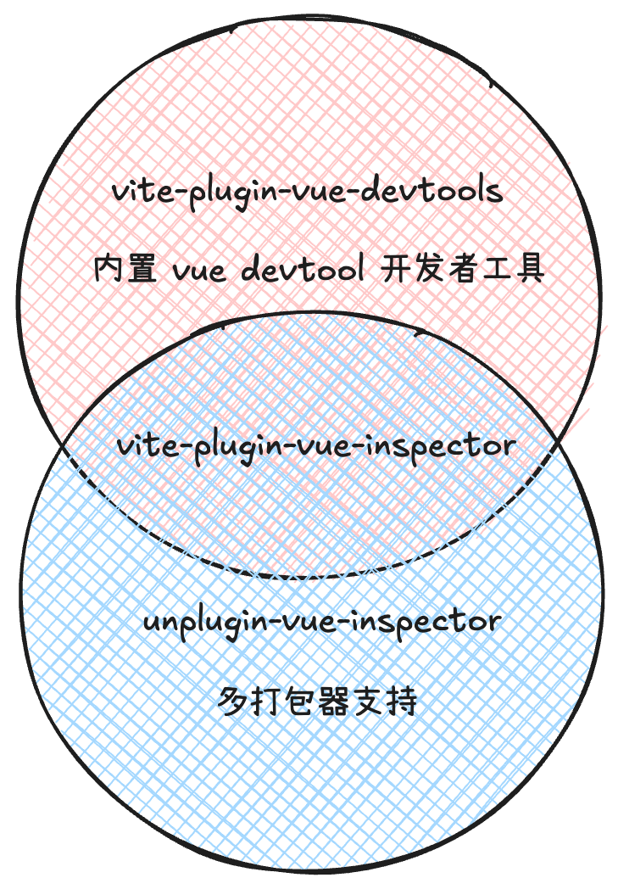

# 点击浏览器的元素时自动跳转到本地 IDE

## 前言

为了加快开发者快速从浏览器中，跳转到本地 `IDE` 中查看元素。在尝试了几种方案之后，最终选用了:

[vite-plugin-vue-inspector](https://www.npmjs.com/package/vite-plugin-vue-inspector) 和 [unplugin-vue-inspector](https://www.npmjs.com/package/unplugin-vue-inspector)

原因主要在于: 

1. 它是由 `vue` 官方团队维护的项目，已经被写在了 [devtools.vuejs.org](https://devtools.vuejs.org/) 文档上，不用担心烂尾，
2. 它支持 `vue2` / `vue3` / `SSR`，符合我们多 `vue` 版本项目的现状。
3. 它支持 `vite` 和 `webpack` 集成，符合我们项目多打包器共存的现状。
4. 它支持多种 `IDE` 集成，跳转到指定代码行的能力，符合我们目前 `vscode` / `webstorm` 混用的现状

## 选型

接下来所有的项目都使用 [unplugin-vue-inspector](https://www.npmjs.com/package/unplugin-vue-inspector) 这个插件去注册

原因在于 [unplugin-vue-inspector](https://www.npmjs.com/package/unplugin-vue-inspector) 实际上是 [vite-plugin-vue-inspector](https://www.npmjs.com/package/vite-plugin-vue-inspector) 的超集，它包含了 `vite-plugin-vue-inspector` 所有的功能和代码，详见 扩展阅读-> 包含关系

## 安装插件

```sh
yarn add -D unplugin-vue-inspector
# or
pnpm i -D unplugin-vue-inspector
```

## 注册插件

### Vite + Vue3 项目

```ts
import { defineConfig } from 'vite'
import Vue from '@vitejs/plugin-vue'

import Inspector from 'unplugin-vue-inspector/vite'

export default defineConfig({
  plugins: [Vue(), Inspector()],
})
```

### Vite + Vue2 项目

```ts
import { defineConfig, } from 'vite'
import { createVuePlugin, } from 'vite-plugin-vue2'
import Inspector from 'unplugin-vue-inspector/vite'

export default defineConfig({
  plugins: [
    createVuePlugin(),
    Inspector({
      vue: 2
    }),
  ],
})
```

## 扩展阅读

### vite-plugin-vue-devtools

这个包是 `vite`/`vue` 团队官方维护的开发者工具包，它内部也包含了 [vite-plugin-vue-inspector](https://www.npmjs.com/package/vite-plugin-vue-inspector) 的所有功能，同时也把整个浏览器 `vue devtools` 插件，也集成到这个 `vite` 插件中了。

但是这个包，只支持 `vue3` + `vite` 项目，原因在于它里面 `vue devtools` 相关的代码只支持 `vue3`，所以假如你要使用它，请在 `vue3` + `vite` 项目中使用, 同时你就可以把 [vite-plugin-vue-inspector](https://www.npmjs.com/package/vite-plugin-vue-inspector) 或 [unplugin-vue-inspector](https://www.npmjs.com/package/unplugin-vue-inspector) 干掉了。

### 包含关系




