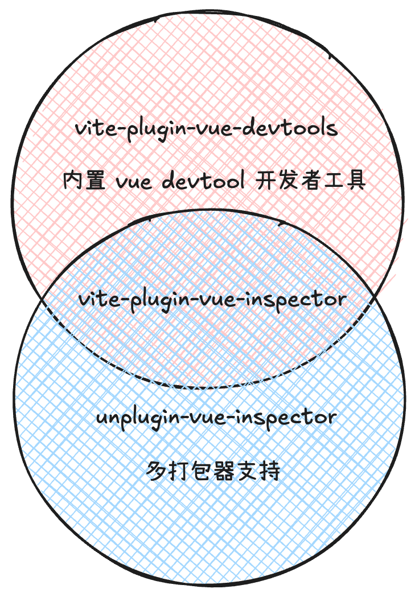

# 点击浏览器元素时自动跳转到本地 IDE

这一页讨论的是一个非常实用、但又很工程化的小能力：

> 当你在浏览器里点到某个 Vue 元素时，能不能直接跳回本地 IDE 对应源代码？

如果你经常在大型项目里排查组件来源、样式污染或模板结构，这个能力非常省时间。

## 先说本质

这类能力通常不是 Vue 运行时原生提供的，而是借助构建插件，在开发态为页面注入“源代码定位信息”。

所以它本质上是一类：

- 开发态增强能力
- 构建工具插件能力
- IDE 集成能力

而不是业务代码层的功能。

## 选型思路

为了让开发者快速从浏览器跳回本地 IDE，这里最终选择了两条路线：

- `vite` 项目：[`vite-plugin-vue-inspector`](https://www.npmjs.com/package/vite-plugin-vue-inspector)
- `webpack` / `vue-cli` 项目：[`code-inspector-plugin`](https://www.npmjs.com/package/code-inspector-plugin)

## 为什么优先选 `vite-plugin-vue-inspector`

### 优势

1. Vue 团队相关生态长期维护，稳定性预期更好
2. 与 Vue 集成度更高，开发体验更自然
3. 支持多种 IDE 跳转
4. 对 `vue2` / `vue3` / SSR 等场景更友好

### 局限

它本质上更偏 Vite 体系。  
即使是它的超集 [`unplugin-vue-inspector`](https://www.npmjs.com/package/unplugin-vue-inspector)，核心支持面也主要还是 `vite` 和 `nuxt`。

## 为什么要保留 `code-inspector-plugin`

### 优势

1. 能覆盖 `webpack` 项目
2. 对 Vue 2 存量项目也更现实
3. 也支持常见 IDE 跳转能力

### 局限

1. 不是 Vue 官方生态主线方案
2. 注入方式更偏通用插件思路，颗粒度不如 Vue 专用方案
3. 社区体量和活跃度通常不如 `vite-plugin-vue-inspector`

## Vite 项目注册插件

### 安装

```sh
yarn add -D vite-plugin-vue-inspector
# or
pnpm i -D vite-plugin-vue-inspector
```

### Vite + Vue 3

```ts
import Vue from '@vitejs/plugin-vue'
import { defineConfig } from 'vite'
import Inspector from 'vite-plugin-vue-inspector'

export default defineConfig({
  plugins: [Vue(), Inspector()],
})
```

### Vite + Vue 2

> Vue 2 已进入 EOL，本节仅用于维护存量项目。

```ts
import Vue from '@vitejs/plugin-vue2'
import { defineConfig } from 'vite'
import Inspector from 'vite-plugin-vue-inspector'

export default defineConfig({
  plugins: [
    Vue(),
    Inspector({
      vue: 2,
    }),
  ],
})
```

### 使用方式

页面中会出现一个可交互入口，或者可以使用快捷键选中元素后跳转到 IDE。

这类能力最适合用在：

- 排查页面元素来源
- 快速定位某个模板或组件
- 排查复杂组件树中的样式命中问题

## Webpack / Vue CLI 项目注册插件

### 安装

```sh
yarn add -D code-inspector-plugin
pnpm i -D code-inspector-plugin
```

### 注册

在 `vue.config.js` 中：

```js
const { defineConfig } = require('@vue/cli-service')
const { codeInspectorPlugin } = require('code-inspector-plugin')

module.exports = defineConfig({
  transpileDependencies: true,
  chainWebpack: (config) => {
    config.plugin('code-inspector-plugin').use(
      codeInspectorPlugin({
        bundler: 'webpack',
      }),
    )
  },
})
```

然后运行开发服务即可。

### 使用方式

插件会在控制台给出提示，例如按住特定快捷键后，点击页面元素即可跳转到 IDE。

## IDE 跳转本质上依赖什么

真正起作用的通常是两部分：

1. 页面里注入了元素到源码位置的映射信息
2. 本地 IDE 命令能被正确调用

所以如果浏览器里点到了元素却打不开 IDE，很多时候不是插件失效，而是本地编辑器命令行没有正确注册。

## 常见故障排查

### VS Code 打不开

如果出现类似：

```txt
Could not open index.vue in the editor.
The editor process exited with an error: spawn code ENOENT ('code' command does not exist in 'PATH').
```

通常说明系统里没有注册 `code` 命令。

处理方式：

1. 在 VS Code 中打开命令面板
2. 搜索 `Shell Command`
3. 执行 `Shell Command: Install 'code' command in PATH`
4. 重启 VS Code

## 扩展阅读

### `vite-plugin-vue-devtools`

它是 Vue / Vite 生态中的官方开发工具方案之一，内部也包含了 `vite-plugin-vue-inspector` 这类能力，并把 Vue Devtools 集成到了开发流程中。

但要注意：

- 它更偏 `vue3` + `vite`
- 如果你已经接了它，某些 inspector 类插件能力可能就不必重复接入

### 包含关系



## 参考资料

- [vite-plugin-vue-inspector](https://www.npmjs.com/package/vite-plugin-vue-inspector)
- [code-inspector-plugin](https://inspector.fe-dev.cn/)

## 一句话理解

浏览器元素跳回本地 IDE，本质上是开发态构建插件为页面注入源码定位信息，再借助本地编辑器命令完成跳转。

## 建议继续阅读

如果你想把这个能力放回 Vue 工程体系里理解，可以继续看：

1. [Vue 编译器介绍](/guide/compiler)
2. [vite dev 和 build 下的 vue 产物](/advanced/vite-dev-build)
3. [构建组件库](/ui/)
